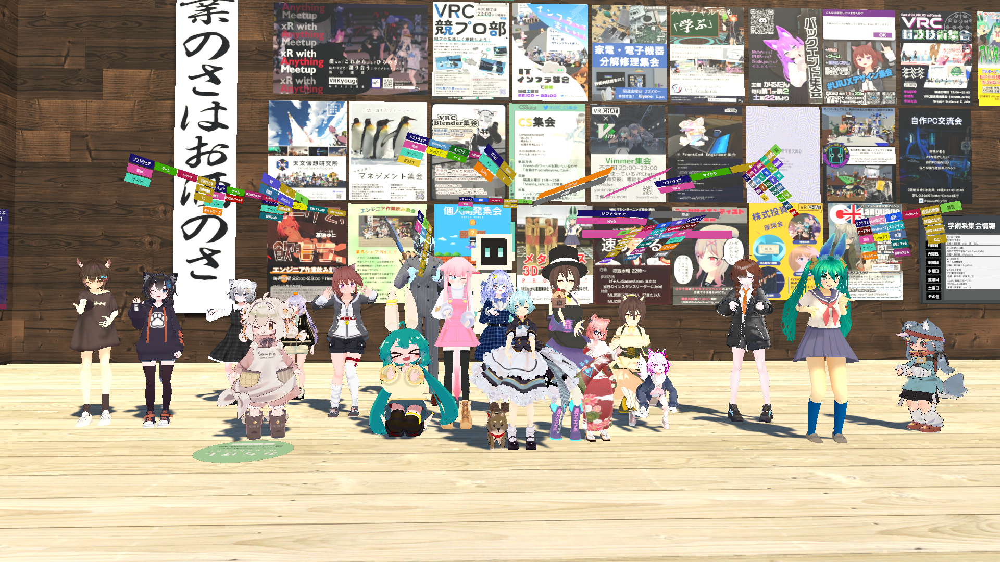
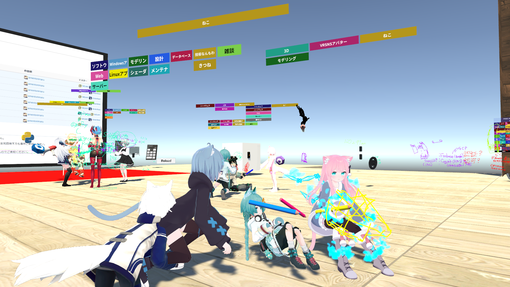
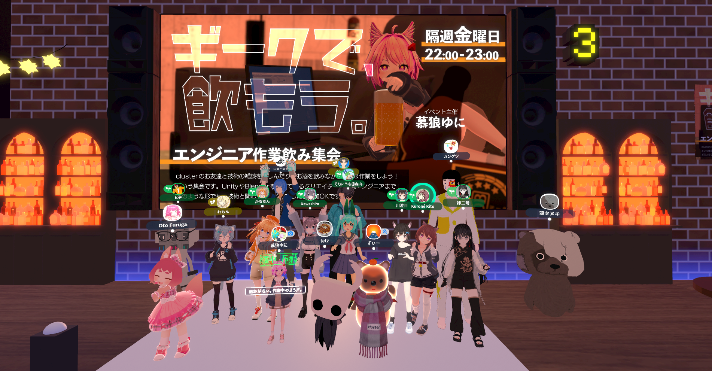
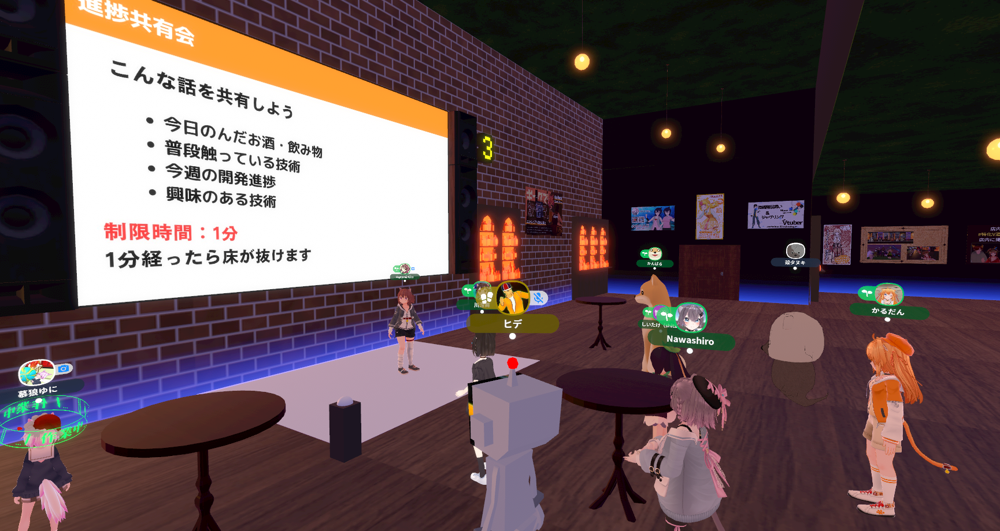
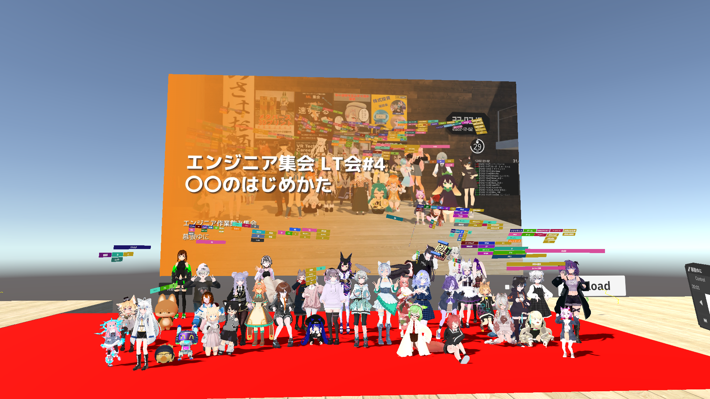
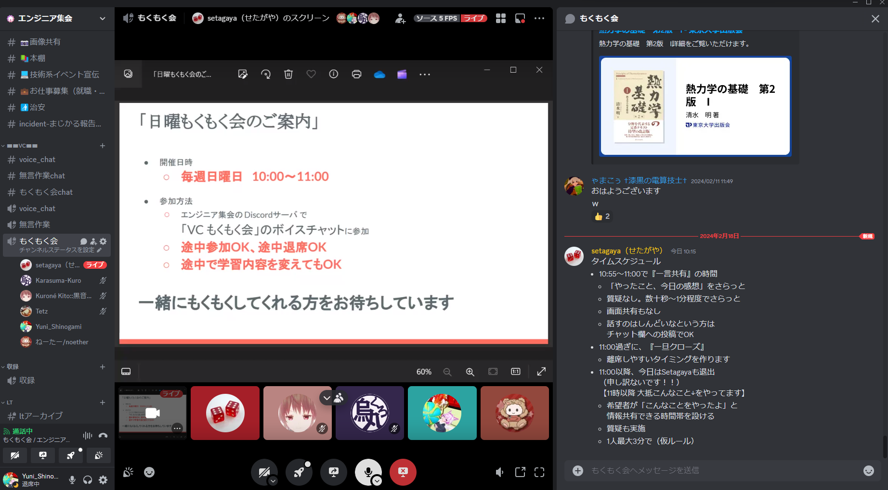

### イベントスケジュール

<iframe src="https://calendar.google.com/calendar/embed?src=engineer.meetup0928%40gmail.com&ctz=Asia%2FTokyo" style={{ width: "100%",  height: "369px", border: "0"}} frameborder="0" scrolling="no"></iframe>

エンジニア集会では、以下のようなイベントを開催しています

### エンジニア作業飲み集会

開催日時：毎週金曜日22:00~  
開催場所：VRChat or cluster（VRChat, clusterで交互に開催）  
スケジュール：
- 22:00 開場
- 22:00 ~ 23:00 自由に雑談
- 23:00 集合写真を撮影
- 23:00 進捗共有会

エンジニア集会の主なイベントは、毎週金曜日に開催している「エンジニア作業飲み集会」です。  
集合写真を撮影した後、進捗共有会を実施しています。

#### イベントの様子

  VRChat会場の集合写真

  VRChat会場の様子

  cluster会場の集合写真

  cluster会場の進捗共有会

### エンジニア集会LT会

開催日時：不定期
開催場所：VRChat

エンジニア集会では、不定期にLT会を開催しています。主な会場はVRChatです。

#### イベントの様子

<iframe style={{ width: "657px",  height: "369px"}} src="https://www.youtube.com/embed/prbLM8lg0Rg?si=pO3EDbAleS3Es5GA" title="YouTube video player" frameborder="0" allow="accelerometer; autoplay; clipboard-write; encrypted-media; gyroscope; picture-in-picture; web-share" allowfullscreen></iframe>

  過去の開催動画はこちら

  エンジニア集会 LT会#4 〇〇のはじめかた

  LT会の集合写真

### もくもく会

開催日時：毎週日曜日10:00~11:00
開催場所：エンジニア集会Discordサーバー

毎週日曜日にエンジニア集会のDiscordサーバーでもくもく会を開催しています。

